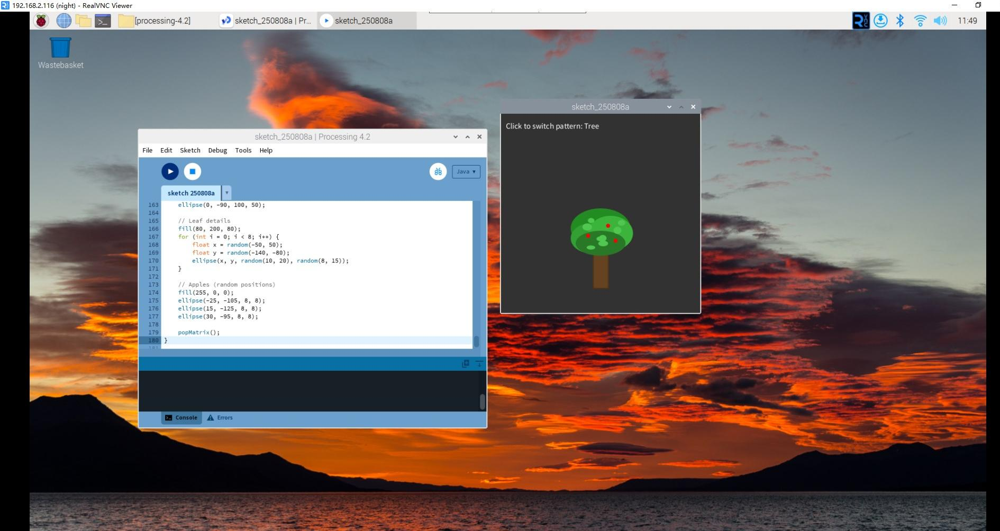

Pattern Generator
==================

In this project, we will create an interactive pattern generator that displays four different artistic patterns. Click the mouse to cycle through beautiful designs including flowers, stars, houses, and trees - all drawn with code!

**Sketch**

.. code-block:: java

    int pattern = 0;

    void setup() {
        size(400, 400);
    }

    void draw() {
        background(50);

        // Display current pattern hint
        fill(255);
        textSize(16);
        text("Click to switch pattern: " + getPatternName(), 10, 30);

        if (pattern == 0) drawFlower();
        else if (pattern == 1) drawStar();
        else if (pattern == 2) drawHouse();
        else drawTree();
    }

    void mousePressed() {
        pattern = (pattern + 1) % 4;
    }

    // Get pattern name
    String getPatternName() {
        if (pattern == 0) return "Flower";
        else if (pattern == 1) return "Star";
        else if (pattern == 2) return "House";
        else return "Tree";
    }

    // Draw flower
    void drawFlower() {
        pushMatrix();
        translate(200, 200);

        // Petals
        fill(255, 100, 150);
        noStroke();
        for (int i = 0; i < 8; i++) {
            pushMatrix();
            rotate(i * PI / 4);
            ellipse(0, 40, 30, 60);
            popMatrix();
        }

        // Center
        fill(255, 255, 0);
        ellipse(0, 0, 40, 40);

        // Stem
        fill(50, 200, 50);
        rect(-5, 0, 10, 100);

        // Leaves
        fill(100, 255, 100);
        ellipse(-20, 60, 25, 15);
        ellipse(20, 80, 25, 15);

        popMatrix();
    }

    // Draw star
    void drawStar() {
        pushMatrix();
        translate(200, 200);

        fill(255, 255, 100);
        stroke(255, 200, 0);
        strokeWeight(2);

        beginShape();
        for (int i = 0; i < 10; i++) {
            float angle = i * PI / 5;
            float radius = (i % 2 == 0) ? 80 : 40;
            float x = cos(angle - PI / 2) * radius;
            float y = sin(angle - PI / 2) * radius;
            vertex(x, y);
        }
        endShape(CLOSE);

        // Star twinkle effect
        fill(255, 255, 255, 150);
        noStroke();
        ellipse(0, 0, 20, 20);

        popMatrix();
    }

    // Draw house
    void drawHouse() {
        pushMatrix();
        translate(200, 250);

        // House body
        fill(200, 150, 100);
        stroke(150, 100, 50);
        strokeWeight(2);
        rect(-80, -60, 160, 120);

        // Roof
        fill(150, 50, 50);
        triangle(-90, -60, 0, -120, 90, -60);

        // Door
        fill(100, 50, 0);
        rect(-20, -10, 40, 70);

        // Door knob
        fill(255, 255, 0);
        ellipse(10, 20, 6, 6);

        // Windows
        fill(150, 200, 255);
        rect(-60, -40, 30, 25);
        rect(30, -40, 30, 25);

        // Window frames
        stroke(100);
        strokeWeight(1);
        line(-45, -40, -45, -15);
        line(-60, -27.5, -30, -27.5);
        line(45, -40, 45, -15);
        line(30, -27.5, 60, -27.5);

        // Chimney
        fill(100, 100, 100);
        rect(40, -110, 20, 40);

        // Smoke
        fill(200, 200, 200, 100);
        ellipse(55, -120, 15, 10);
        ellipse(60, -130, 12, 8);
        ellipse(65, -140, 10, 6);

        popMatrix();
    }

    // Draw tree
    void drawTree() {
        pushMatrix();
        translate(200, 350);

        // Trunk
        fill(101, 67, 33);
        stroke(80, 50, 20);
        strokeWeight(2);
        rect(-15, -80, 30, 80);

        // Crown – multiple green circles
        noStroke();
        fill(34, 139, 34);
        ellipse(0, -120, 120, 80);

        fill(50, 160, 50);
        ellipse(-20, -100, 80, 60);

        fill(60, 180, 60);
        ellipse(20, -110, 90, 70);

        fill(40, 120, 40);
        ellipse(0, -90, 100, 50);

        // Leaf details
        fill(80, 200, 80);
        for (int i = 0; i < 8; i++) {
            float x = random(-50, 50);
            float y = random(-140, -80);
            ellipse(x, y, random(10, 20), random(8, 15));
        }

        // Apples (random positions)
        fill(255, 0, 0);
        ellipse(-25, -105, 8, 8);
        ellipse(15, -125, 8, 8);
        ellipse(30, -95, 8, 8);

        popMatrix();
    }

**How it works?**

This pattern generator demonstrates several important programming concepts:

**State Management:**
- The ``pattern`` variable keeps track of which design to display (0-3)
- ``mousePressed()`` function cycles through patterns using modulo operator: ``(pattern + 1) % 4``

**Modular Code Design:**
- Each pattern has its own function: ``drawFlower()``, ``drawStar()``, ``drawHouse()``, ``drawTree()``
- The main ``draw()`` function uses conditional statements to choose which pattern to display
- ``getPatternName()`` function provides user-friendly pattern names

**Advanced Drawing Techniques:**
- **Matrix transformations**: ``pushMatrix()`` and ``popMatrix()`` save and restore coordinate systems
- **Translation**: ``translate()`` moves the origin point for easier drawing
- **Rotation**: ``rotate()`` creates symmetrical patterns (like flower petals)
- **Loops**: ``for`` loops create repeated elements efficiently

**Visual Effects:**
- **Color gradients**: Different ``fill()`` colors create depth and realism
- **Transparency**: Alpha values create semi-transparent effects (like smoke)
- **Layering**: Multiple shapes build complex designs
- **Random elements**: ``random()`` adds natural variation to tree leaves

**Key Functions Used:**
- ``ellipse()``, ``rect()``, ``triangle()`` for basic shapes
- ``beginShape()`` and ``vertex()`` for custom star shape
- ``stroke()`` and ``strokeWeight()`` for outlines
- ``line()`` for details like window frames

**Interactive Features:**
- Click anywhere to see the next pattern
- Pattern name displays at the top
- Smooth transitions between different artistic styles

This project shows how code can create beautiful art while teaching fundamental programming concepts!

For more please refer to `Processing Reference <https://processing.org/reference/>`_.