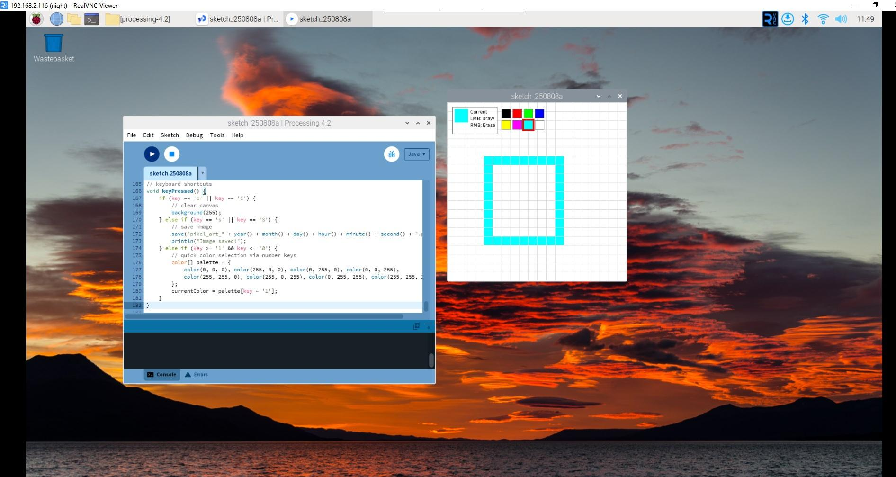

Pixel Art Canvas
=================

In this project, we'll create a digital pixel art canvas where you can draw colorful artwork! Use your mouse to paint on a grid, choose from 8 different colors, and save your masterpieces. It's like having a mini painting program!

**Sketch**

.. code-block:: java

    // Pixel Canvas – drag-to-draw support
    color currentColor;
    int gridSize = 20;
    boolean isDrawing = false;

    void setup() {
        size(400, 400);
        background(255);
        currentColor = color(0, 0, 0); // default black
    }

    void draw() {
        // draw grid
        drawGrid();

        // show current color and tool tips
        drawUI();

        // drag-to-draw
        if (isDrawing && mousePressed) {
            drawPixel(mouseX, mouseY);
        }
    }

    // draw grid lines
    void drawGrid() {
        stroke(220);
        strokeWeight(1);

        // vertical lines
        for (int i = 0; i <= width; i += gridSize) {
            line(i, 0, i, height);
        }

        // horizontal lines
        for (int i = 0; i <= height; i += gridSize) {
            line(0, i, width, i);
        }
    }

    // draw a single pixel
    void drawPixel(int x, int y) {
        int gridX = (x / gridSize) * gridSize;
        int gridY = (y / gridSize) * gridSize;

        // stay within canvas bounds
        if (gridX >= 0 && gridX < width && gridY >= 0 && gridY < height) {
            fill(currentColor);
            noStroke();
            rect(gridX, gridY, gridSize, gridSize);
        }
    }

    // draw user interface
    void drawUI() {
        // current color display
        fill(255, 255, 255, 200);
        stroke(100);
        rect(10, 10, 100, 60);

        fill(currentColor);
        noStroke();
        rect(15, 15, 30, 30);

        fill(0);
        textSize(12);
        text("Current", 50, 25);
        text("LMB: Draw", 50, 40);
        text("RMB: Erase", 50, 55);

        // color palette
        drawColorPalette();
    }

    // draw color palette
    void drawColorPalette() {
        color[] palette = {
            color(0, 0, 0),      // black
            color(255, 0, 0),    // red
            color(0, 255, 0),    // green
            color(0, 0, 255),    // blue
            color(255, 255, 0),  // yellow
            color(255, 0, 255),  // magenta
            color(0, 255, 255),  // cyan
            color(255, 255, 255) // white
        };

        for (int i = 0; i < palette.length; i++) {
            fill(palette[i]);
            stroke(100);
            strokeWeight(1);

            int x = 120 + (i % 4) * 25;
            int y = 15 + (i / 4) * 25;
            rect(x, y, 20, 20);

            // highlight current color
            if (palette[i] == currentColor) {
                noFill();
                stroke(255, 0, 0);
                strokeWeight(3);
                rect(x - 2, y - 2, 24, 24);
            }
        }
    }

    // start drawing on mouse press
    void mousePressed() {
        // check if a color swatch was clicked
        if (selectColor()) return;

        isDrawing = true;

        if (mouseButton == LEFT) {
            // left button draws
            drawPixel(mouseX, mouseY);
        } else if (mouseButton == RIGHT) {
            // right button erases (white)
            color tempColor = currentColor;
            currentColor = color(255);
            drawPixel(mouseX, mouseY);
            currentColor = tempColor;
        }
    }

    // continue drawing while dragging
    void mouseDragged() {
        if (isDrawing) {
            if (mouseButton == LEFT) {
                drawPixel(mouseX, mouseY);
            } else if (mouseButton == RIGHT) {
                // right button erases
                color tempColor = currentColor;
                currentColor = color(255);
                drawPixel(mouseX, mouseY);
                currentColor = tempColor;
            }
        }
    }

    // stop drawing on mouse release
    void mouseReleased() {
        isDrawing = false;
    }

    // color selection logic
    boolean selectColor() {
        color[] palette = {
            color(0, 0, 0), color(255, 0, 0), color(0, 255, 0), color(0, 0, 255),
            color(255, 255, 0), color(255, 0, 255), color(0, 255, 255), color(255, 255, 255)
        };

        for (int i = 0; i < palette.length; i++) {
            int x = 120 + (i % 4) * 25;
            int y = 15 + (i / 4) * 25;

            if (mouseX >= x && mouseX <= x + 20 && mouseY >= y && mouseY <= y + 20) {
                currentColor = palette[i];
                return true;
            }
        }
        return false;
    }

    // keyboard shortcuts
    void keyPressed() {
        if (key == 'c' || key == 'C') {
            // clear canvas
            background(255);
        } else if (key == 's' || key == 'S') {
            // save image
            save("pixel_art_" + year() + month() + day() + hour() + minute() + second() + ".png");
            println("Image saved!");
        } else if (key >= '1' && key <= '8') {
            // quick color selection via number keys
            color[] palette = {
                color(0, 0, 0), color(255, 0, 0), color(0, 255, 0), color(0, 0, 255),
                color(255, 255, 0), color(255, 0, 255), color(0, 255, 255), color(255, 255, 255)
            };
            currentColor = palette[key - '1'];
        }
    }

**How it works?**

This pixel art canvas demonstrates advanced interactive programming concepts:

**Grid-Based Drawing System:**
- The canvas is divided into a 20x20 pixel grid using ``gridSize = 20``
- ``drawGrid()`` draws guide lines to show pixel boundaries
- ``drawPixel()`` snaps drawing to the grid using integer division: ``(x / gridSize) * gridSize``

**Color Management:**
- Eight-color palette stored in a ``color[]`` array
- ``currentColor`` variable tracks the selected color
- ``drawColorPalette()`` creates clickable color swatches
- Red outline highlights the currently selected color

**Advanced Mouse Interaction:**
- **Left-click drawing**: ``mouseButton == LEFT`` paints with current color
- **Right-click erasing**: ``mouseButton == RIGHT`` paints white to erase
- **Drag support**: ``mouseDragged()`` enables continuous drawing while moving
- **State tracking**: ``isDrawing`` boolean prevents accidental drawing

**User Interface Elements:**
- Real-time color preview in top-left corner
- Interactive color palette with visual feedback
- Clear instructions displayed on screen
- Professional-looking semi-transparent panels

**File Operations:**
- **Save artwork**: Press 'S' to export as PNG with timestamp
- **Clear canvas**: Press 'C' to start fresh
- **Quick color selection**: Press number keys 1-8 for instant color switching

**Collision Detection:**
- ``selectColor()`` function checks if mouse clicks are within color swatches
- Boundary checking ensures drawing stays within canvas limits
- Pixel-perfect hit detection for color selection

**Key Programming Concepts:**
- **State machines**: Drawing/not-drawing states
- **Modular functions**: Each feature has its own function
- **Event handling**: Multiple input methods (mouse, keyboard)
- **User feedback**: Visual cues for all interactions
- **Data persistence**: Save/load functionality

**Creative Features:**
- Smooth drawing experience with drag support
- Professional color palette
- Instant visual feedback
- Multiple interaction methods for different user preferences

This project shows how to build a complete creative application with a polished user interface!

For more please refer to `Processing Reference <https://processing.org/reference/>`_.