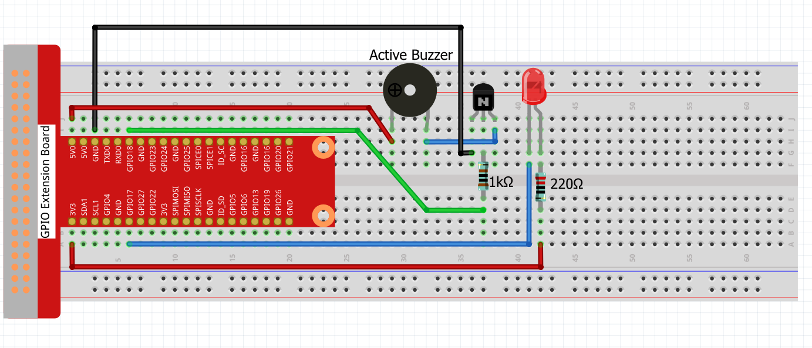
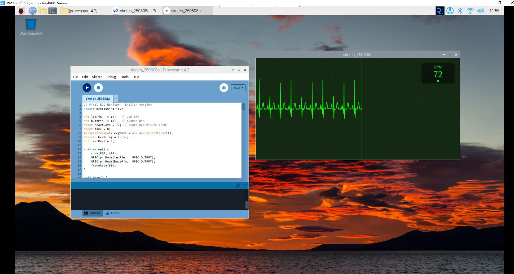

ECG Heart Monitor
==================

In this advanced project, we'll create a realistic heart rate monitor that displays ECG (electrocardiogram) waveforms on screen while controlling LED and buzzer for heartbeat simulation. This medical-style interface shows real-time heart rhythm patterns just like professional monitoring equipment!

**Circuit**

**Sketch**

.. code-block:: java

    // Pixel ECG Monitor – English version
    import processing.io.*;

    int ledPin   = 17;   // LED pin
    int buzzPin  = 18;   // buzzer pin
    float heartRate = 72; // beats per minute (BPM)
    float time = 0;
    ArrayList<Float> ecgWave = new ArrayList<Float>();
    boolean beatFlag = false;
    int lastBeat = 0;

    void setup() {
        size(800, 400);
        GPIO.pinMode(ledPin,   GPIO.OUTPUT);
        GPIO.pinMode(buzzPin,  GPIO.OUTPUT);
        frameRate(60);
    }

    void draw() {
        background(20, 40, 20); // dark-medical green

        // generate ECG waveform
        generateECGWave();

        // draw medical grid
        drawMedicalGrid();

        // plot the waveform
        drawECGLine();

        // display numeric heart-rate
        displayHeartRate();

        // control LED & buzzer heartbeat
        controlHeartbeat();

        time += 0.02;
    }

    // medical grid background
    void drawMedicalGrid() {
        stroke(0, 100, 0, 80); // soft green
        strokeWeight(1);

        // major grid (every 50 px)
        for (int x = 0; x < width; x += 50)  line(x, 0, x, height);
        for (int y = 0; y < height; y += 50) line(0, y, width, y);

        // minor grid (every 10 px)
        stroke(0, 60, 0, 40);
        for (int x = 0; x < width; x += 10)  line(x, 0, x, height);
        for (int y = 0; y < height; y += 10) line(0, y, width, y);
    }

    // plot the ECG trace
    void drawECGLine() {
        if (ecgWave.size() > 1) {
            stroke(0, 255, 0); // bright green
            strokeWeight(2);
            noFill();
            beginShape();
            for (int i = 0; i < ecgWave.size(); i++) vertex(i, ecgWave.get(i));
            endShape();

            // scanning line effect
            stroke(0, 255, 0, 150);
            strokeWeight(1);
            line(ecgWave.size() - 1, 0, ecgWave.size() - 1, height);
        }
    }

    // show BPM value
    void displayHeartRate() {
        // background panel
        fill(0, 0, 0, 120);
        noStroke();
        rect(width - 150, 20, 130, 80, 10);

        // labels
        fill(0, 255, 0);
        textAlign(CENTER);
        textSize(16);
        text("BPM", width - 85, 40);

        // number
        textSize(36);
        text(int(heartRate), width - 85, 75);

        // status indicator
        fill(heartRate > 100 ? color(255, 0, 0) : color(0, 255, 0));
        ellipse(width - 85, 90, 8, 8);
    }

    // drive LED & buzzer on every beat
    void controlHeartbeat() {
        if (beatFlag) {
            GPIO.digitalWrite(ledPin, GPIO.HIGH);

            // short beep
            if (millis() - lastBeat < 100)  GPIO.digitalWrite(buzzPin, GPIO.HIGH);
            else                             GPIO.digitalWrite(buzzPin, GPIO.LOW);

            // heartbeat duration 200 ms
            if (millis() - lastBeat > 200) {
                beatFlag = false;
                GPIO.digitalWrite(ledPin,  GPIO.LOW);
                GPIO.digitalWrite(buzzPin, GPIO.LOW);
            }
        }
    }

    // create synthetic ECG data
    void generateECGWave() {
        float beatInterval = 60.0 / heartRate; // seconds
        float pos = (time % beatInterval) / beatInterval;

        float val = 0;

        // P-wave (atrial depolarization)
        if (pos >= 0.05 && pos < 0.15) {
            float p = (pos - 0.05) / 0.1;
            val = 15 * sin(p * PI);
        }
        // QRS complex (ventricular depolarization)
        else if (pos >= 0.25 && pos < 0.35) {
            float qrs = (pos - 0.25) / 0.1;
            if      (qrs < 0.2)  val = -25 * sin(qrs * PI * 5);          // Q
            else if (qrs < 0.5)  val = 120 * sin((qrs - 0.2) * PI * 3.33); // R
            else                 val = -40 * sin((qrs - 0.5) * PI * 2);     // S

            // trigger beat on R-wave
            if (!beatFlag && qrs > 0.3) {
                beatFlag = true;
                lastBeat = millis();
            }
        }
        // T-wave (ventricular repolarization)
        else if (pos >= 0.55 && pos < 0.75) {
            float t = (pos - 0.55) / 0.2;
            val = 25 * sin(t * PI);
        }

        // baseline + small noise
        val += random(-2, 2);
        ecgWave.add(height / 2 - val);

        // keep trace within screen width
        if (ecgWave.size() > width) ecgWave.remove(0);
    }

    // keyboard controls for demo
    void keyPressed() {
        if (key == '+' || key == '=') heartRate = min(heartRate + 5, 150);
        else if (key == '-')          heartRate = max(heartRate - 5, 40);
    }

**How it works?**

This ECG heart monitor demonstrates sophisticated real-time data visualization and hardware control:

**Medical ECG Simulation:**
- **Authentic waveform generation**: Creates realistic P-QRS-T wave patterns that match real electrocardiograms
- **P-wave**: Represents atrial depolarization (heart chambers filling)
- **QRS complex**: Shows ventricular depolarization (main heartbeat contraction)
- **T-wave**: Indicates ventricular repolarization (heart muscle recovery)
- **Baseline noise**: Adds realistic signal variations like real medical equipment

**Professional Medical Interface:**
- **Medical grid background**: Dual-layer grid system (major/minor) like real ECG paper
- **Hospital-style colors**: Dark green background with bright green trace
- **Real-time scanning line**: Moving cursor effect simulating oscilloscope display
- **Digital readout**: Large BPM display with status indicator (red for high, green for normal)

**Real-time Data Processing:**
- **Continuous waveform**: Uses ``ArrayList<Float>`` to store scrolling ECG data
- **Timing calculations**: Converts BPM to beat intervals using ``60.0 / heartRate``
- **Phase tracking**: Monitors heartbeat cycle position to generate correct waveform shapes
- **Buffer management**: Automatically removes old data points to maintain screen width

**Hardware Integration:**
- **LED heartbeat**: Flashes LED on each R-wave peak (main heartbeat moment)
- **Audio feedback**: Buzzer creates short beep sounds synchronized with heartbeat
- **Pulse timing**: 200ms LED duration and 100ms buzzer beep for realistic timing
- **Beat detection**: Triggers hardware only during R-wave peak for accuracy

**Interactive Controls:**
- **Adjustable heart rate**: Press '+' to increase BPM, '-' to decrease
- **Rate limits**: Constrained between 40-150 BPM for safety
- **Real-time updates**: Changes immediately affect waveform speed and hardware timing

**Advanced Programming Concepts:**
- **State machines**: Beat detection and hardware control states
- **Signal processing**: Mathematical waveform generation using trigonometric functions
- **Real-time rendering**: Smooth 60 FPS display updates
- **Hardware synchronization**: Precise timing between visual and physical feedback
- **Medical accuracy**: Waveform timing matches real cardiac cycles

**Educational Value:**
- **Medical knowledge**: Learn about heart rhythm and ECG interpretation
- **Data visualization**: Professional-grade real-time graphing techniques
- **Hardware control**: Synchronized audio-visual feedback systems
- **Mathematical modeling**: Sine wave combinations create complex realistic patterns

This project bridges the gap between digital simulation and real-world medical technology!

For more please refer to `Processing Reference <https://processing.org/reference/>`_.