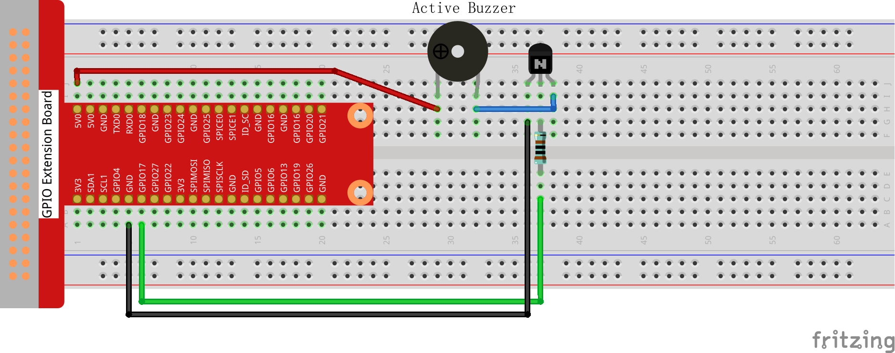
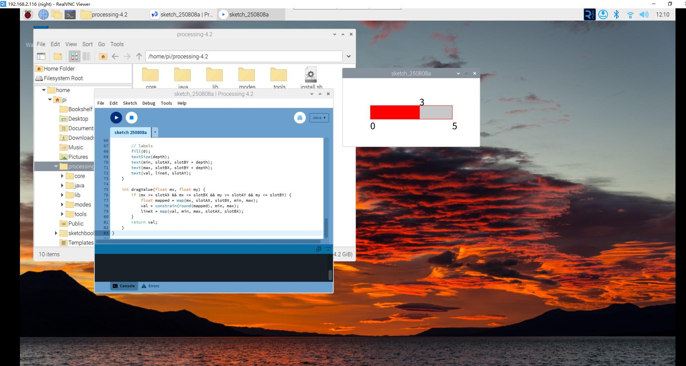

Interactive Metronome
=====================

In this project, we'll create a digital metronome with an interactive slider control and buzzer feedback. The metronome has 6 levels (0-5): level 0 is silent, and levels 1-5 provide increasingly rapid beats to help musicians practice at different tempos.

**Circuit**

**Sketch**

.. code-block:: Arduino

    import processing.io.*;

    int level = 0;
    int buzzerPin = 18;
    int levelRange = 5;
    Slider mySlider;

    void setup() {
        size(400, 200);
        frameRate(50);
        mySlider = new Slider(width * 0.2f, height * 0.4f, width * 0.8f, height * 0.6f,
                            0, levelRange, level);
        GPIO.pinMode(buzzerPin, GPIO.OUTPUT);
    }

    void draw() {
        background(255);
        mySlider.display();

        if (level == 0) {
            GPIO.digitalWrite(buzzerPin, GPIO.LOW);
        } else if ((frameCount / (levelRange - level + 1)) % 2 == 0) {
            GPIO.digitalWrite(buzzerPin, GPIO.LOW);
        } else {
            GPIO.digitalWrite(buzzerPin, GPIO.HIGH);
        }
    }

    void mouseDragged() {
        level = mySlider.dragValue(mouseX, mouseY);
    }

    // ------------------------------------------------------------------
    //  Slider class
    // ------------------------------------------------------------------
    class Slider {
        float slotAX, slotBX, slotAY, slotBY;
        float lineX;
        float depth;
        int max, min, val;

        Slider(float ax, float ay, float bx, float by, int minVal, int maxVal, int current) {
            slotAX = ax;
            slotAY = ay;
            slotBX = bx;
            slotBY = by;
            min   = minVal;
            max   = maxVal;
            val   = current;

            lineX = map(val, min, max, slotAX, slotBX);
            depth = (slotBY - slotAY) * 0.75f;
        }

        void display() {
            rectMode(CORNERS);

            // track
            fill(200);
            stroke(255, 0, 0);
            rect(slotAX, slotAY, slotBX, slotBY);

            // filled portion
            fill(255, 0, 0);
            rect(slotAX, slotAY, lineX, slotBY);

            // labels
            fill(0);
            textSize(depth);
            text(min, slotAX, slotBY + depth);
            text(max, slotBX, slotBY + depth);
            text(val, lineX, slotAY);
        }

        int dragValue(float mx, float my) {
            if (mx >= slotAX && mx <= slotBX && my >= slotAY && my <= slotBY) {
                float mapped = map(mx, slotAX, slotBX, min, max);
                val = constrain(round(mapped), min, max);
                lineX = map(val, min, max, slotAX, slotBX);
            }
            return val;
        }
    }

**How it works?**

This interactive metronome demonstrates custom widget creation and real-time audio control:

**Custom Slider Widget:**
- **Slider Class**: Creates a reusable UI component with ``Slider(ax, ay, bx, by, minVal, maxVal, current)``
- **7 Parameters**: Position coordinates (ax,ay) to (bx,by), value range (min to max), and initial value
- **Visual Design**: Red-filled track showing current position with numerical labels
- **Interactive Control**: ``dragValue()`` method handles mouse dragging with boundary checking

**Metronome Logic:**
- **6 Tempo Levels**: Level 0 (silent) through Level 5 (fastest tempo)
- **Variable Speed Formula**: ``frameCount / (levelRange - level + 1) % 2``
- **Beat Calculation**: Higher levels create faster alternating on/off cycles
- **Hardware Output**: Controls GPIO buzzer pin for audible beats

**Real-time Beat Generation:**
The tempo algorithm works as follows:
- **Level 0**: No sound (buzzer always OFF)
- **Level 1**: Slowest tempo: ``frameCount / 5 % 2`` (beat every 5 frames)
- **Level 2**: Medium-slow: ``frameCount / 4 % 2`` (beat every 4 frames)  
- **Level 3**: Medium: ``frameCount / 3 % 2`` (beat every 3 frames)
- **Level 4**: Medium-fast: ``frameCount / 2 % 2`` (beat every 2 frames)
- **Level 5**: Fastest: ``frameCount / 1 % 2`` (beat every frame)

**Interactive Features:**
- **Mouse Control**: Drag slider to instantly change tempo
- **Visual Feedback**: Slider position and numerical value update in real-time
- **Audio Feedback**: Buzzer immediately responds to tempo changes
- **Smooth Operation**: 50 FPS refresh rate ensures responsive interaction

**Programming Concepts:**
- **Object-Oriented Design**: Custom Slider class with encapsulated functionality
- **Mathematical Mapping**: ``map()`` function converts mouse position to tempo values
- **Constraint Handling**: ``constrain()`` keeps values within valid range
- **Modular Code**: Separate display and interaction methods
- **Real-time Control**: Frame-based timing for consistent beat generation

**User Interface Design:**
- **Clear Visual Hierarchy**: Slider track, fill, and labels clearly show current state
- **Immediate Response**: No delay between slider movement and tempo change
- **Boundary Feedback**: Slider cannot be dragged outside valid range
- **Professional Appearance**: Clean red and white color scheme

This project shows how to create professional-looking interactive controls for real-time audio applications!

For more please refer to `Processing Reference <https://processing.org/reference/>`_.