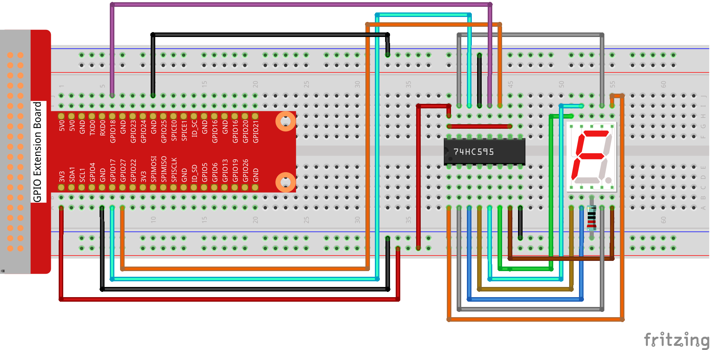
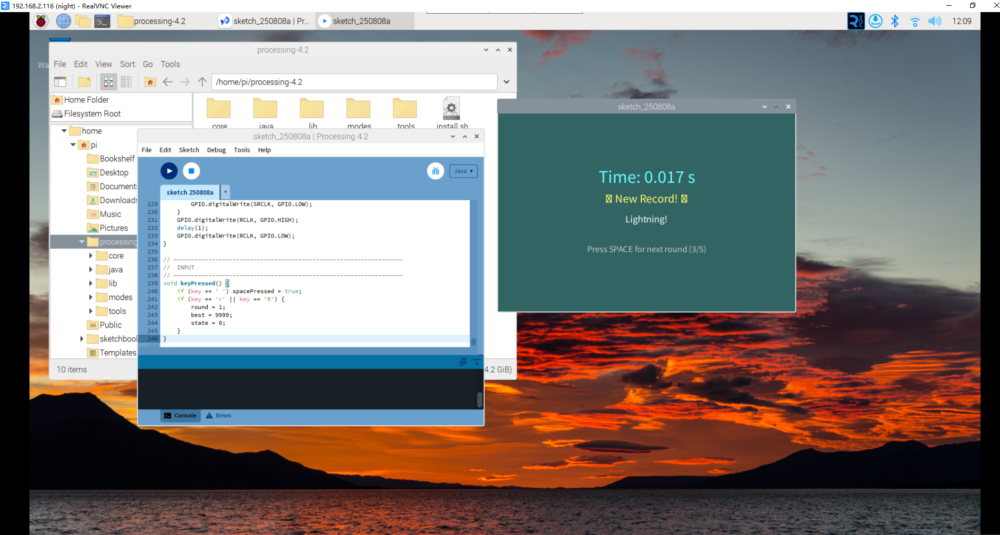

Reaction Speed Tester
======================

In this advanced project, we'll create a reaction speed testing game that measures how quickly you can respond to visual cues. The game uses a 7-segment display to show your reaction time and provides multiple rounds of testing with performance feedback!

**Circuit**

**Sketch**

.. code-block:: java
    
    // Reaction-Speed Tester – 7-Segment Display Edition
    import processing.io.*;

    // 74HC595 pins
    int SDI   = 17;   // serial data in
    int RCLK  = 18;   // register clock (latch)
    int SRCLK = 27;   // shift-clock

    // common-cathode segment codes 0-9
    int[] segCode = {0x3f, 0x06, 0x5b, 0x4f, 0x66, 0x6d, 0x7d, 0x07, 0x7f, 0x6f};

    // game states
    int state = 0;
    int start, reaction = 0;
    int best = 9999;
    boolean spacePressed = false;
    int round = 1;
    int maxRounds = 5;

    // countdown
    int cdStart, cdDuration;

    void setup() {
        size(600, 400);
        frameRate(60);

        GPIO.pinMode(SDI,   GPIO.OUTPUT);
        GPIO.pinMode(RCLK,  GPIO.OUTPUT);
        GPIO.pinMode(SRCLK, GPIO.OUTPUT);

        hc595_shift(segCode[0]);
    }

    void draw() {
        switch (state) {
            case 0: drawWelcome(); break;
            case 1: drawCountdown(); break;
            case 2: drawWait(); break;
            case 3: drawReaction(); break;
            case 4: drawResult(); break;
        }
        spacePressed = false;
    }

    // ------------------------------------------------------------------
    //  SCREENS
    // ------------------------------------------------------------------
    void drawWelcome() {
        background(50, 50, 100);

        fill(255, 255, 100);
        textAlign(CENTER);
        textSize(48);
        text("Reaction Test", width / 2, height / 2 - 100);

        textSize(24);
        fill(255);
        text("Test your reaction speed!", width / 2, height / 2 - 40);
        text("Press SPACE as soon as you see 'GO!'", width / 2, height / 2 - 10);
        text("7-segment shows your time", width / 2, height / 2 + 20);

        textSize(20);
        fill(100, 255, 100);
        text("Round " + round + " / " + maxRounds, width / 2, height / 2 + 60);

        textSize(32);
        fill(255, 100, 100);
        text("Press SPACE to start!", width / 2, height / 2 + 120);

        if (best < 9999) {
            textSize(18);
            fill(255, 255, 0);
            text("Best: 0." + nf(best, 3) + " s", width / 2, height / 2 + 160);
        }

        hc595_shift(segCode[0]);

        if (spacePressed) {
            state = 1;
            cdStart = millis();
            cdDuration = int(random(2000, 5000));
        }
    }

    void drawCountdown() {
        background(100, 50, 50);

        fill(255, 100, 100);
        textAlign(CENTER);
        textSize(72);
        text("Ready...", width / 2, height / 2 - 50);

        textSize(24);
        fill(255, 200, 200);
        text("Wait for GO!", width / 2, height / 2 + 30);
        text("Don’t press early!", width / 2, height / 2 + 60);

        int elapsed = millis() - cdStart;
        int remain  = max(0, (cdDuration - elapsed) / 1000 + 1);
        if (remain > 0) hc595_shift(segCode[min(remain, 9)]);

        if (spacePressed) {
            state = 4;
            reaction = -1; // false start
            return;
        }

        if (elapsed >= cdDuration) {
            state = 2;
            start = millis();
        }
    }

    void drawWait() {
        background(100, 100, 50);

        fill(255, 255, 100);
        textAlign(CENTER);
        textSize(96);
        text("GO!", width / 2, height / 2);

        textSize(24);
        fill(255, 255, 200);
        text("Press SPACE now!", width / 2, height / 2 + 80);

        hc595_shift(segCode[8]); // show 8 for GO!

        if (spacePressed) {
            reaction = millis() - start;
            state = 3;
        }

        if (millis() - start > 2000) {
            reaction = 9999; // timeout
            state = 4;
        }
    }

    void drawReaction() {
        background(50, 100, 50);

        fill(100, 255, 100);
        textAlign(CENTER);
        textSize(48);
        text("Reaction:", width / 2, height / 2 - 40);

        textSize(72);
        text("0." + nf(reaction, 3) + " s", width / 2, height / 2 + 20);

        int digit = (reaction / 100) % 10;
        hc595_shift(segCode[digit]);

        if (millis() - start > 2000) state = 4;
    }

    void drawResult() {
        if (reaction == -1) {           // false start
            background(150, 50, 50);
            fill(255, 100, 100);
            textAlign(CENTER);
            textSize(48);
            text("False Start!", width / 2, height / 2 - 40);
            textSize(24);
            text("Wait for the GO! signal", width / 2, height / 2 + 20);
            hc595_shift(segCode[0]);
        } else if (reaction >= 9999) {  // timeout
            background(100, 50, 50);
            fill(255, 150, 100);
            textAlign(CENTER);
            textSize(48);
            text("Too Slow!", width / 2, height / 2 - 40);
            textSize(24);
            text("> 2 s timeout", width / 2, height / 2 + 20);
            hc595_shift(segCode[9]);
        } else {                        // valid result
            background(50, 100, 100);
            fill(100, 255, 255);
            textAlign(CENTER);
            textSize(36);
            text("Time: 0." + nf(reaction, 3) + " s", width / 2, height / 2 - 60);

            if (reaction < best) {
                best = reaction;
                fill(255, 255, 100);
                textSize(24);
                text("🎉 New Record! 🎉", width / 2, height / 2 - 20);
            }

            String rating = "";
            if (reaction < 200) rating = "Lightning!";
            else if (reaction < 300) rating = "Very fast!";
            else if (reaction < 400) rating = "Fast!";
            else if (reaction < 500) rating = "Good!";
            else rating = "Keep practising";

            fill(255);
            textSize(20);
            text(rating, width / 2, height / 2 + 20);

            int digit = (reaction / 100) % 10;
            hc595_shift(segCode[digit]);
        }

        // next or finish
        fill(200);
        textSize(18);
        if (round < maxRounds) {
            text("Press SPACE for next round (" + (round + 1) + "/" + maxRounds + ")",
                width / 2, height / 2 + 80);
            if (spacePressed) {
                round++;
                state = 0;
            }
        } else {
            text("Done! Best time: 0." + nf(best, 3) + " s", width / 2, height / 2 + 80);
            text("Press R to restart", width / 2, height / 2 + 110);
        }
    }

    // ------------------------------------------------------------------
    //  74HC595 helper
    // ------------------------------------------------------------------
    void hc595_shift(int data) {
        for (int i = 0; i < 8; i++) {
            int bit = (data << i) & 0x80;
            GPIO.digitalWrite(SDI, bit != 0 ? GPIO.HIGH : GPIO.LOW);
            GPIO.digitalWrite(SRCLK, GPIO.HIGH);
            delay(1);
            GPIO.digitalWrite(SRCLK, GPIO.LOW);
        }
        GPIO.digitalWrite(RCLK, GPIO.HIGH);
        delay(1);
        GPIO.digitalWrite(RCLK, GPIO.LOW);
    }

    // ------------------------------------------------------------------
    //  INPUT
    // ------------------------------------------------------------------
    void keyPressed() {
        if (key == ' ') spacePressed = true;
        if (key == 'r' || key == 'R') {
            round = 1;
            best = 9999;
            state = 0;
        }
    }

**How it works?**

This reaction speed tester demonstrates advanced game programming and precise timing measurement:

**Game State Management:**
- **5 Game States**: Welcome (0), Countdown (1), Wait for GO (2), Show Reaction (3), Results (4)
- **State Machine**: Clean transitions between different game phases
- **Round System**: 5 rounds of testing with progress tracking
- **Session Memory**: Tracks best time across all rounds

**Reaction Time Measurement:**
- **Precise Timing**: Uses ``millis()`` for millisecond-accurate measurements
- **Random Delays**: 2-5 second countdown prevents anticipation cheating
- **False Start Detection**: Penalizes early button presses during countdown
- **Timeout Handling**: 2-second limit prevents indefinite waiting

**7-Segment Display Integration:**
- **74HC595 Control**: Uses shift register for efficient 7-segment driving
- **Dynamic Display**: Shows countdown numbers, GO signal (8), and reaction digits
- **Meaningful Feedback**: Displays the tens-of-milliseconds digit (0.1-0.9 seconds)
- **Status Indication**: Different numbers for different game states

**User Interface Design:**
- **Multi-Screen Layout**: Professional game flow with distinct visual phases
- **Color-Coded States**: Different background colors for each game phase
- **Performance Feedback**: Ratings from "Lightning!" to "Keep practising"
- **Progress Tracking**: Shows current round and session statistics

**Advanced Timing Logic:**
The core timing calculation works as follows:
- **Countdown Phase**: Random 2-5 second delay prevents pattern recognition
- **GO Signal**: Precisely records the moment GO appears
- **Response Detection**: Measures exact time between GO and spacebar press
- **Accuracy**: Displays reaction time as 0.XXX seconds format

**Game Features:**
- **False Start Protection**: Pressing space during countdown triggers penalty
- **New Record Celebration**: Visual feedback for personal best times
- **Performance Rating System**: Contextual feedback based on reaction speed
- **Session Statistics**: Tracks and displays best time across all rounds

**Hardware Synchronization:**
- **Real-time Display**: 7-segment shows relevant information for each game state
- **Immediate Feedback**: Display updates instantly with game state changes
- **Visual Consistency**: Screen and hardware display work together

**Programming Concepts:**
- **State Machines**: Clean game flow management
- **Precise Timing**: Millisecond-accurate measurements
- **Hardware Control**: GPIO and shift register manipulation
- **User Experience**: Professional game design principles
- **Data Validation**: False start and timeout error handling

**Educational Value:**
- **Reaction Science**: Learn about human response times and factors affecting them
- **Timing Systems**: Understand how computers measure precise time intervals
- **Game Design**: Experience complete game development lifecycle
- **Hardware Integration**: See how software and hardware work together

This project bridges gaming, science, and engineering - perfect for understanding both human performance and computer precision!  

