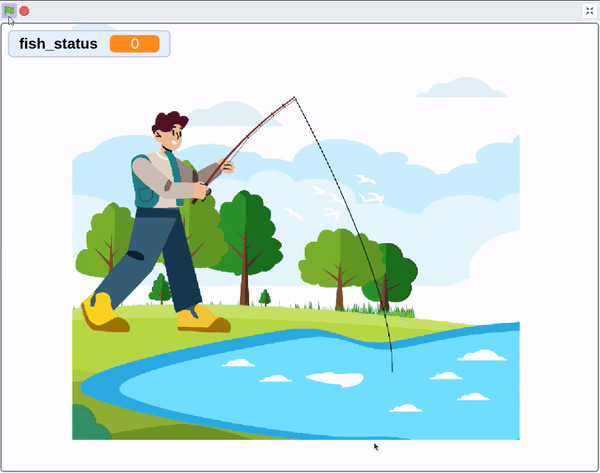
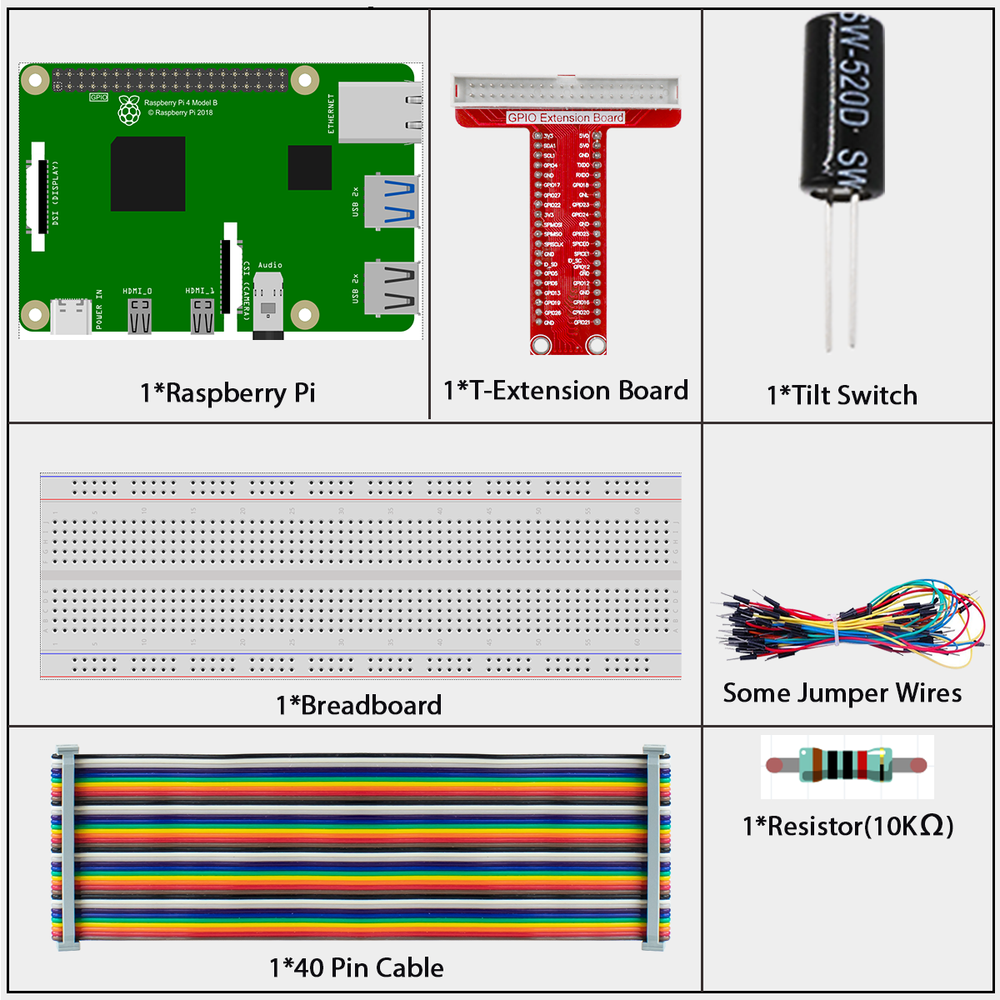
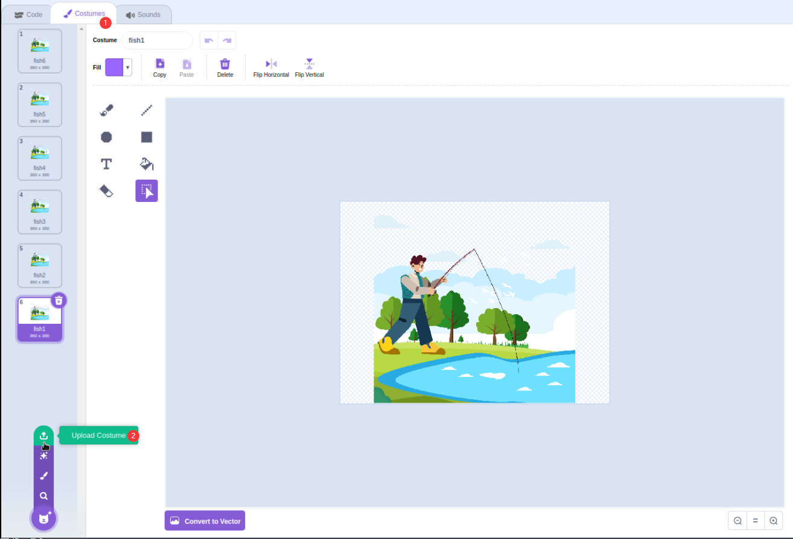
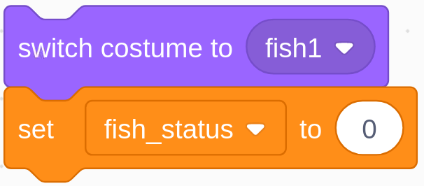
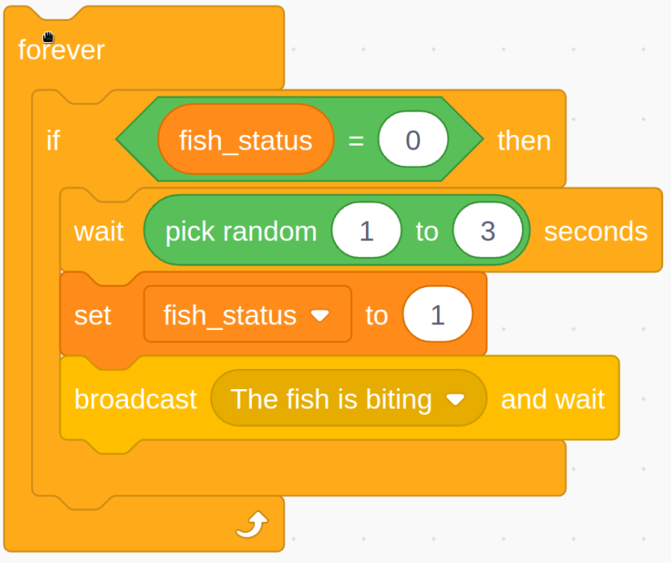
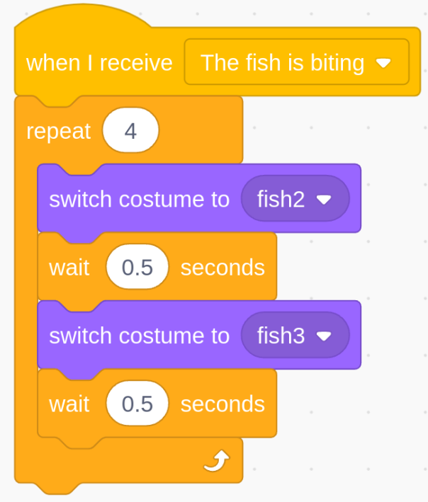
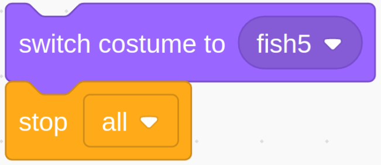
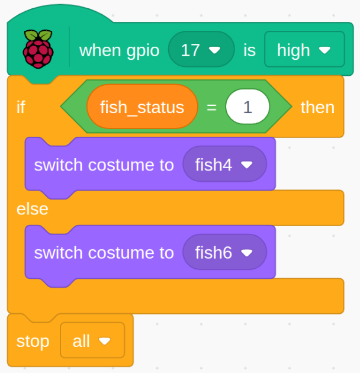

# 1.8 Fishing

Today, we will make a fishing game.

Observe the water on the stage area and if you find a fish on the hook, remember to tilt the switch to catch it.

## Required Components

In this project, we need the following components.

## Build the Circuit

## Load the Code and See What Happens

Load the code file (`1.8_fishing.sb3`) to Scratch 3.

You will see a child is fishing, after a period of time when the water surface movement, you can shake the tilt switch to catch the fish. Remember, if you do not keep shaking the switch, the fish will escape.

## Tips on Sprite

Select Sprite1, click **Costumes** in the upper left corner; upload 6 pictures (**fish1** to **fish6**) from the `~/super-starter-kit-for-raspberry-pi/scratch/picture` path via the **Upload Costume** button; delete the default 2 costumes and rename the sprite to **fish**.

## Tips on Codes

Set the initial costume of the **fish** sprite to **fish1** and assign the value of **fish_status** to 0 (when **fish_status=0**, it means the fish is not hooked, when **fish_status=1**, it means the fish is hooked).

When **fish_status=0**, i.e. the fish is not hooked yet, start the fishing game. Wait for a random time from 0 to 3 seconds, then assign **fish_status** to 1, which means the fish is hooked, and broadcast a message “The fish is biting”.

Note

The purpose of the broadcast block is to send a message to other code blocks or other sprites. The message can be either a request or a command.

When the message “The fish is biting” is received, let the fish sprite switch between the **fish2** and **fish3** costumes so that we can see the fish biting.

After switching the costume, if the game is not over, it means that the fish is off the hook and gone, so that we will switch the **fish** sprite costume to **fish5** (fish slipped state).

When gpio17 is high (the tilt switch is tilted), it means the fishing rod is pulled up. At this time, the value of fish_status is judged. If it is 1, it means that the fishing rod was pulled up when the fish was hooked and switched to fish4 costume (fish was caught). On the contrary, it means that the fishing rod pulled up when the fish is not hooked is switched to the fish6 costume (nothing is caught).

